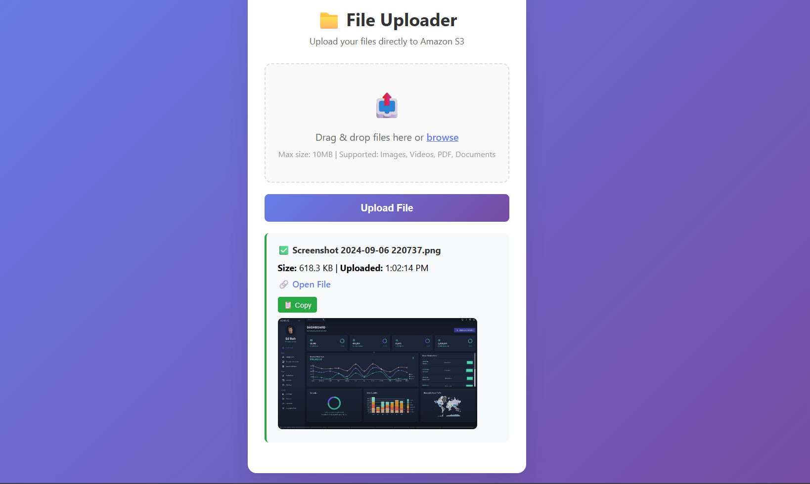

# 📁 S3 File Uploader

[](https://github.com/shivaraj245/s3-file-uploade)
[](https://opensource.org/licenses/MIT)

A modern, responsive drag-and-drop file uploader that uploads directly to Amazon S3 with secure pre-signed URLs. No server storage needed - files go straight to the cloud!



## ✨ Features

- 🖱️ **Drag & Drop** - Intuitive file upload with visual feedback
- 📁 **Multiple File Types** - Images, PDFs, Documents, Text files  
- 📏 **Size Validation** - 10MB max per file with clear error messages
- 🔒 **Secure Upload** - Direct S3 upload with pre-signed URLs (60s expiry)
- 📱 **Fully Responsive** - Works perfectly on desktop, tablet & mobile
- 🔗 **Instant Links** - Get shareable URLs immediately after upload
- 📋 **Copy to Clipboard** - One-click URL copying
- 🖼️ **Image Preview** - Thumbnail previews for uploaded images
- ⚡ **Real-time Progress** - Visual upload progress indicator

## 🛠️ Tech Stack

**Frontend:** HTML5, CSS3, Vanilla JavaScript  
**Backend:** Node.js, Express.js, AWS SDK  
**Storage:** Amazon S3

## 📋 Prerequisites

- [Node.js](https://nodejs.org/) (v14 or higher)
- [AWS Account](https://aws.amazon.com/) with S3 access
- AWS IAM user with S3 permissions (`s3:PutObject`, `s3:GetObject`)
- Modern web browser (Chrome, Firefox, Safari, Edge)

## 🚀 Quick Start

```bash
# Clone repository
git clone https://github.com/shivaraj245/s3-file-uploade.git
cd s3-file-uploade

# Setup backend
cd back
npm install
# Create .env file with AWS credentials (see below)
npm start

# Open frontend
cd ../front
open index.html
```

## ⚙️ Configuration

Create `.env` file in `back/` directory:
```env
PORT=8080
AWS_ACCESS_KEY_ID=your_access_key
AWS_SECRET_ACCESS_KEY=your_secret_key
AWS_REGION=ap-south-1
S3_BUCKET=your-bucket-name
```

**S3 CORS Configuration:**
```json
[
  {
    "AllowedHeaders": ["*"],
    "AllowedMethods": ["GET", "PUT"],
    "AllowedOrigins": ["*"],
    "ExposeHeaders": ["ETag"]
  }
]
```

**Required IAM Permissions:**
```json
{
  "Version": "2012-10-17",
  "Statement": [{
    "Effect": "Allow",
    "Action": ["s3:PutObject", "s3:GetObject"],
    "Resource": "arn:aws:s3:::your-bucket-name/*"
  }]
}
```

## 📂 File Support

| Type | Formats | Extensions |
|------|---------|------------|
| **Images** | JPEG, PNG, GIF, WebP | `.jpg`, `.jpeg`, `.png`, `.gif`, `.webp` |
| **Documents** | PDF, Word | `.pdf`, `.doc`, `.docx` |
| **Text** | Plain Text | `.txt` |

**Limits:** 10MB max per file | **Security:** File type validation | **Storage:** Direct to S3

## 🔧 API Reference

**Base URL:** `http://localhost:8080`

| Method | Endpoint | Description | Response |
|--------|----------|-------------|----------|
| `GET` | `/s3Url` | Get pre-signed upload URL | `{"url": "https://bucket.s3.amazonaws.com/..."}` |

**Usage Example:**
```javascript
// Get upload URL
const response = await fetch('/s3Url');
const { url } = await response.json();

// Upload file directly to S3
await fetch(url, {
  method: 'PUT',
  body: file,
  headers: { 'Content-Type': file.type }
});
```

### Environment Variables
Set these in your deployment platform:
```
AWS_ACCESS_KEY_ID=your_key
AWS_SECRET_ACCESS_KEY=your_secret
AWS_REGION=ap-south-1
S3_BUCKET=your-bucket
```

## 🐛 Troubleshooting

| Issue | Solution |
|-------|----------|
| **CORS Error** | Check S3 bucket CORS configuration |
| **403 Forbidden** | Verify AWS IAM permissions for your user |
| **Port Already in Use** | Change `PORT` in `.env` or kill process on port 8080 |
| **File Upload Fails** | Ensure S3 bucket exists and is accessible |
| **Large File Error** | Reduce file size or increase `MAX_FILE_SIZE` limit |

**Debug Mode:** Set `NODE_ENV=development` for detailed logging

## 🔧 Customization

**Change File Size Limit:**
```javascript
// In front/index.js
const MAX_FILE_SIZE = 20 * 1024 * 1024; // 20MB
```

**Add New File Types:**
```javascript
// In front/index.js
const ALLOWED_TYPES = {
  'application/zip': 'ZIP Archive',
  // ... existing types
};
```

## 📊 Project Structure

```
s3-file-uploade/
├── back/           # Node.js backend
│   ├── server.js   # Express server
│   ├── s3.js       # S3 configuration
│   └── .env        # Environment variables
└── front/          # Frontend assets
    ├── index.html  # Main HTML
    ├── index.css   # Styling
    └── index.js    # JavaScript logic
```

## 📄 License

MIT License - see [LICENSE](LICENSE) file

---

⭐ **Star this repo if helpful!**  
**Made by [Shivaraj](https://github.com/shivaraj245)**